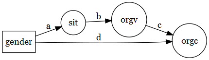
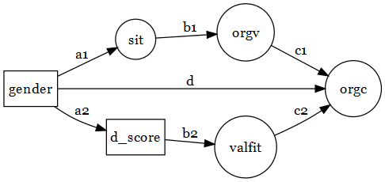
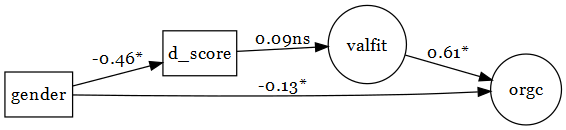
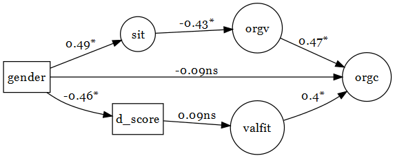

```{r setup, include=FALSE}
knitr::opts_chunk$set(echo = TRUE)
knitr::opts_knit$set(root.dir = normalizePath("../..")) 
library(plyr)
library(dplyr)
library(readr)
library(tidyr)
library(purrr)
library(lavaan)
library(DiagrammeR)

```

```{r,  include=FALSE, cache = TRUE}
#read in data

source("R/pvaluer.R")

sem_file_names <- 
  c("t1_clean", "t2_clean",
   "iat_dscores.csv")

data <- 
list.files(path = "data/preprocessed/", 
           pattern = paste(sem_file_names, collapse = "|"), 
           full.names = T) %>% 
  map(read_csv) %>% join_all(., by = "ID") %>% 
  as_data_frame() %>% 
  select(-gender)

#gender is also a variable in t1 so I read in the 
#master seperatley and then merge the dfs.

data <- 
read_csv("data/preprocessed/master_id.csv") %>% 
  left_join(., data) %>% 
  select(grep("^ID$|^gender$|commit.*|t1\\.sit.*|d_score|value", 
              names(.))) %>% 
  mutate(gender_num = ifelse(gender == "Male", 0, 1), 
         d_score = ifelse(gender == "Female", 
                          d_score*-1, d_score))

```


```{r,  include=FALSE, cache = TRUE}
#define models to fit

models <-c(model1 =  
  '#measurement model
sit =~ t1.sit1 + t1.sit2 + t1.sit3 + t1.sit4 

orgv =~ t1.org.value1 + t1.org.value2 + t1.org.value3 +
t1.org.value4 + t1.org.value5 + t1.org.value6 + t1.org.value7 +
t1.org.value8

orgc =~ t2.org.commit1 + t2.org.commit2 + t2.org.commit3 + 
t2.org.commit4 + t2.org.commit5 + t2.org.commit6 

#structure model
#indirect paths
sit ~ a*gender_num
orgv ~ b*sit
orgc ~ c*orgv

#direct path
orgc ~ d*gender_num


#compute indirect path
indirect_path := a*b*c
direct_path := indirect_path + d
d_prime := d
', 
model2 = '#measurement model

    valfit =~ t2.personal.values.match.organization1 +
    t2.personal.values.match.organization2 +
    t2.personal.values.match.organization3

    orgc =~ t2.org.commit1 + t2.org.commit2 + t2.org.commit3 + 
    t2.org.commit4 + t2.org.commit5 + t2.org.commit6 
    
    #structure model
    #indirect paths
    d_score  ~ a*gender_num
    valfit ~ b*d_score
    orgc ~ c*valfit
    
    #direct path
    orgc ~ d*gender_num
    
    
    #compute indirect path
    indirect_path := a*b*c
    direct_path := indirect_path + d
    d_prime := d
    ',
model3 = 
  '#measurement model

sit =~ t1.sit1 + t1.sit2 + t1.sit3 + t1.sit4 

orgv =~ t1.org.value1 + t1.org.value2 + t1.org.value3 +
t1.org.value4 + t1.org.value5 + t1.org.value6 + t1.org.value7 +
t1.org.value8

valfit =~ t2.personal.values.match.organization1 +
    t2.personal.values.match.organization2 +
    t2.personal.values.match.organization3

orgc =~ t2.org.commit1 + t2.org.commit2 + t2.org.commit3 + 
t2.org.commit4 + t2.org.commit5 + t2.org.commit6 

#structure model for path 1
#indirect paths
sit ~ a1*gender_num
orgv ~ b1*sit
orgc ~ c1*orgv

#structure model for path 2
#indirect paths
d_score  ~ a2*gender_num
valfit ~ b2*d_score
orgc ~ c2*valfit


#direct path
orgc ~ d*gender_num


#compute indirect path
indirect_path1 := a1*b1*c1
indirect_path2 := a2*b2*c2
direct_path := indirect_path1 + indirect_path2 + d
d_prime := d
') 


```

```{r,  include=FALSE, cache = TRUE}
#fit the models
fits <- 
  map(models, ~ sem(., data))

#get tidy parameter estimates

tidy_tables <- 
  map(fits, ~ parameterestimates(.,standardized = T)) %>% 
  bind_rows(., .id = "mid") 
  

# get parameter est
parameter_ests <- 
tidy_tables %>% 
  filter(op == "~") %>% 
  rename(predictor = rhs, outcome = lhs) %>% 
    select(mid, outcome, predictor, label,  est = std.all, z, pvalue) %>% map_if(is.numeric, ~ round(.,2)) %>% 
  map_at("pvalue", format_pval) %>% 
  as_data_frame() 

#get direct and indirect effects
indirect_effects <- 
tidy_tables %>% 
  filter(op == ":=") %>% 
  rename(predictor = rhs, outcome = lhs) %>% 
    select(mid, label,  est = std.all, z, pvalue) %>% map_if(is.numeric, ~ round(.,2)) %>% 
  map_at("pvalue", format_pval) %>% 
  as_data_frame() 

#get fit measures

fit_measures <- 
  map(fits, ~ fitmeasures(. , c("chisq", "pvalue", "rmsea", "cfi")) %>% data_frame(fm = names(.), stat = .) %>% 
        spread(fm, stat)) %>% bind_rows(.id = "mid")


```

```{r,  include=FALSE, cache = TRUE}
#make diagrams

#make node list

nodes_list_for_both_models <- 
tidy_tables %>% filter(op == "~") %>% 
  select(mid, lhs, rhs) %>% 
  gather(term_name, term, lhs, rhs) %>% 
  select(-term_name) %>% 
  group_by(mid) %>% 
  do(distinct(.)) %>% 
  rename(nodes = term) %>%
  mutate(shape = ifelse(nodes == "gender_num" | 
                          nodes == "d_score", "box", "circle"), 
         label = ifelse(nodes == "gender_num", "gender", nodes)) %>% 
  ungroup() %>% 
  split(.$mid) %>% 
  map(as.data.frame)

#make edge list

edges_list_for_both_models <- 
tidy_tables %>% filter(op == "~") %>% 
  select(mid, lhs, rhs, std.all, pvalue) %>% 
  rename(from = rhs, to = lhs) %>% 
  mutate(sig = ifelse(pvalue < .05, 
                      "*", "ns"), 
    label = sprintf("%s%s", round(std.all, 2), 
                         sig)) %>% 
  select(-std.all, -pvalue, -sig) %>% 
  ungroup() %>% 
  split(.$mid) %>% 
  map(as.data.frame)

#make graph objects with no estimates

edge_list_no_est <- 
edges_list_for_both_models %>% 
  map_at(c("model1", "model2"), 
         ~ mutate(., label = letters[1:4])) %>% 
  map_at("model3", 
         ~ mutate(., label = c("a1", "b1", "c1",
                                 "a2", "b2", "c2", "d")))

#make graph objects with estiamtes

graphs_with_est <- 
map2(nodes_list_for_both_models, edges_list_for_both_models, 
     ~ create_graph(nodes = .x, edges = .y, 
                    graph_attrs = "rankdir = LR"))

graphs_without_est <- 
  map2(nodes_list_for_both_models, edge_list_no_est, 
       ~create_graph(nodes = .x, edges =.y, 
       graph_attrs = "rankdir = LR"))

#write out the graphs

plot_filenames <- 
  c("model1_w_est", "model2_w_est", "model3_w_est", 
    "model1_wo_est", "model2_wo_est", "model3_wo_est")
plot_filenames <- 
  paste0("plots/", plot_filenames, ".png")

walk2(c(graphs_with_est, graphs_without_est), plot_filenames, ~
       export_graph(.x, .y, 
             file_type = "png"))

```


## Overview of models

We test three models. Below I've diagrammed simplified versions of the models. The diagrams use standard SEM notation such that circles indicate latent variables and squares indicate manifest variables.

### Model 1

* gender = participant gender (Male = 0; Female = 1)
* sit = social identity threat
* orgv = feeling valued by the organization.
* orgc = organizational commitment



### Model 2 

* gender = participant gender (Male = 0; Female = 1)
* d_score = d score coded as high numbers = stronger association between own gender and engineering
* valfit = fit between own values and organization values
* orgc = organizational commitment


### Model 3

* Model 3 combines models 1 and 2.



##Fitting models

Each model was tested using SEM. The parameter estimates are all standardized and can be directly compared. 

### Resutls from model 1 


#### Parameter estimates


```{r, echo = FALSE}
parameter_ests %>% filter(mid == "model1") %>%  
  knitr::kable()
```

#### Direct and indirect effects

The indirect effect is significant and fully explains the relationship between gender and organizational commitment. 

```{r, echo = FALSE}
indirect_effects %>% filter(mid == "model1") %>% 
  knitr::kable()
```

### Results from model 2



#### Parameter estimates

```{r, echo = FALSE}
parameter_ests %>% filter(mid == "model2") %>%  
  knitr::kable()
```


#### Direct and indirect effects

Here we don't see evidence of a significant indirect effects. Largely because of a lack of relationship between the IAT scores and value fit. 

```{r, echo = FALSE}
indirect_effects %>% filter(mid == "model2") %>% 
  knitr::kable()
```

### Results from model 3



#### Parameter estimates

```{r, echo = FALSE}
parameter_ests %>% filter(mid == "model3") %>%  
  knitr::kable()
```


#### Direct and indirect effects

The the results from model 3 largely mirror those of models 1 and 2. 

```{r, echo = FALSE}
indirect_effects %>% filter(mid == "model3") %>% 
  knitr::kable()
```


##Model fits

* Good fit is typically indicated any of the following:
    * CFI > .95
    * A non-significant chi-squared 
    * RMSEA < .05

* Model 2 doesn't fit the data well but models 1 and two aren't too horrible.

```{r}
fit_measures %>% knitr::kable()
```

