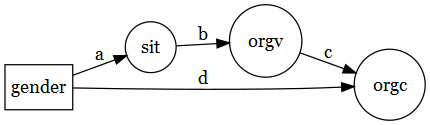
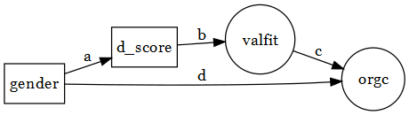
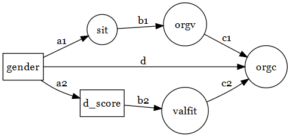
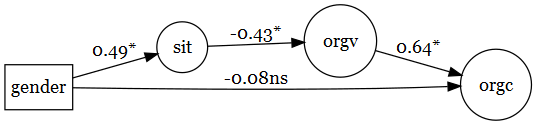
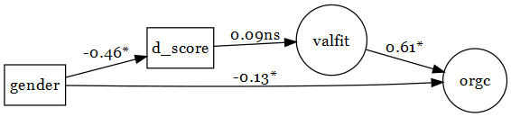
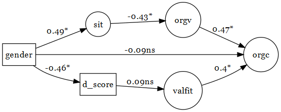

sem\_analyses
================
William Hall
June 21, 2016

Overview of models
------------------

We test three models. Below I've diagrammed simplified versions of the models. The diagrams use standard SEM notation such that circles indicate latent variables and squares indicate manifest variables.

### Model 1

-   gender = participant gender (Male = 0; Female = 1)
-   sit = social identity threat
-   orgv = feeling valued by the organization.
-   orgc = organizational commitment



### Model 2

-   gender = participant gender (Male = 0; Female = 1)
-   d\_score = d score coded as high numbers = stronger association between own gender and engineering
-   valfit = fit between own values and organization values
-   orgc = organizational commitment



### Model 3

-   Model 3 combines models 1 and 2.



Fitting models
--------------

Each model was tested using SEM. The parameter estimates are all standardized and can be directly compared.

### Resutls from model 1



#### Parameter estimates

| mid    | outcome | predictor   | label |    est|      z| pvalue    |
|:-------|:--------|:------------|:------|------:|------:|:----------|
| model1 | sit     | gender\_num | a     |   0.49|   7.94| &lt; .001 |
| model1 | orgv    | sit         | b     |  -0.43|  -6.16| &lt; .001 |
| model1 | orgc    | orgv        | c     |   0.64|   7.80| &lt; .001 |
| model1 | orgc    | gender\_num | d     |  -0.08|  -1.50| .130      |

#### Direct and indirect effects

The indirect effect is significant and fully explains the relationship between gender and organizational commitment.

| mid    | label          |    est|      z| pvalue    |
|:-------|:---------------|------:|------:|:----------|
| model1 | indirect\_path |  -0.13|  -4.59| &lt; .001 |
| model1 | direct\_path   |  -0.21|  -3.64| &lt; .001 |
| model1 | d\_prime       |  -0.08|  -1.50| .130      |

### Results from model 2



#### Parameter estimates

| mid    | outcome  | predictor   | label |    est|      z| pvalue    |
|:-------|:---------|:------------|:------|------:|------:|:----------|
| model2 | d\_score | gender\_num | a     |  -0.46|  -8.42| &lt; .001 |
| model2 | valfit   | d\_score    | b     |   0.09|   1.44| .150      |
| model2 | orgc     | valfit      | c     |   0.61|   8.29| &lt; .001 |
| model2 | orgc     | gender\_num | d     |  -0.13|  -2.43| .020      |

#### Direct and indirect effects

Here we don't see evidence of a significant indirect effects. Largely because of a lack of relationship between the IAT scores and value fit.

| mid    | label          |    est|      z| pvalue |
|:-------|:---------------|------:|------:|:-------|
| model2 | indirect\_path |  -0.03|  -1.40| .160   |
| model2 | direct\_path   |  -0.15|  -2.75| .010   |
| model2 | d\_prime       |  -0.13|  -2.43| .020   |

### Results from model 3



#### Parameter estimates

| mid    | outcome  | predictor   | label |    est|      z| pvalue    |
|:-------|:---------|:------------|:------|------:|------:|:----------|
| model3 | sit      | gender\_num | a1    |   0.49|   7.94| &lt; .001 |
| model3 | orgv     | sit         | b1    |  -0.43|  -6.12| &lt; .001 |
| model3 | orgc     | orgv        | c1    |   0.47|   6.43| &lt; .001 |
| model3 | d\_score | gender\_num | a2    |  -0.46|  -8.42| &lt; .001 |
| model3 | valfit   | d\_score    | b2    |   0.09|   1.41| .160      |
| model3 | orgc     | valfit      | c2    |   0.40|   6.27| &lt; .001 |
| model3 | orgc     | gender\_num | d     |  -0.09|  -1.75| .080      |

#### Direct and indirect effects

The the results from model 3 largely mirror those of models 1 and 2.

| mid    | label           |    est|      z| pvalue    |
|:-------|:----------------|------:|------:|:----------|
| model3 | indirect\_path1 |  -0.10|  -4.25| &lt; .001 |
| model3 | indirect\_path2 |  -0.02|  -1.36| .170      |
| model3 | direct\_path    |  -0.21|  -3.55| &lt; .001 |
| model3 | d\_prime        |  -0.09|  -1.75| .080      |

Model fits
----------

-   Good fit is typically indicated any of the following:
    -   CFI &gt; .95
    -   A non-significant chi-squared
    -   RMSEA &lt; .05
-   Model 2 doesn't fit the data well but models 1 and two aren't too horrible.

``` r
fit_measures %>% knitr::kable()
```

| mid    |        cfi|     chisq|  pvalue|      rmsea|
|:-------|----------:|---------:|-------:|----------:|
| model1 |  0.9073205|  436.3320|       0|  0.0857923|
| model2 |  0.9073433|  217.4711|       0|  0.1262780|
| model3 |  0.8882961|  684.2638|       0|  0.0882651|
